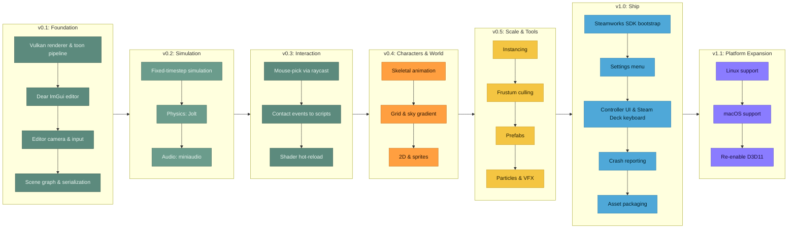

# ToonEngine


A from-scratch, cross-platform stylized rendering engine built on Vulkan via [Diligent
Engine](https://github.com/DiligentGraphics/DiligentEngine), with a full in-editor scene
authoring workflow: an entity hierarchy, an inspector, transform gizmos, and a live-tunable
HDR post-processing stack, all built on the abstraction layer described below.

*A [Skylotus Studios](LICENSE.md) project.*


## Highlights

- Custom toon/cel-shading pipeline: banded diffuse lighting plus inverted-hull silhouette
  outlines, with per-object base and outline color and width, applied the same way to
  procedural primitives and textured glTF models.
- Cascaded shadow maps (4 cascades, PCF-filtered) via Diligent's own `ShadowMapManager`,
  feeding directly into the cel-shading ramp, so a shadowed pixel lands on a darker rung of
  the same toon band ladder.
- Full HDR post-processing stack via DiligentFX's `PostFXContext`: temporal-denoised SSAO,
  TAA, depth of field, screen-space reflections, bloom, and an ACES filmic tone map, every
  parameter live-tunable from the editor.
- Real scene graph: an entity tree with hierarchy-composed world transforms, parent/child
  relationships, and world-preserving reparenting, so dragging an object under a new parent
  doesn't move it in world space.
- Play / Pause / Step simulation control on a fixed 60 Hz sim tick, decoupled from and
  interpolated into the render rate: an explicit editing-vs-playing mode with a
  snapshot-and-restore sandbox, so testing gameplay never permanently alters a hand-placed
  scene.
- Native gameplay scripting: per-entity `Update` hooks through a script-component slot
  (Unity/Hazel-style), reconstructed from a name registry so scripts round-trip through
  scene save/load and the Play/Pause/Step sandbox alike.
- Physics and collision via Jolt Physics: independent Collider and Rigid Body entity
  components (Box/Sphere/Capsule; Static/Dynamic/Kinematic), built fresh from the scene on
  Play and stepped on the same fixed tick, with a collider debug wireframe overlay.
- Scene serialization: save/load the full hierarchy, transforms, materials, and lighting to
  a human-readable text file. Procedural geometry round-trips from its generator parameters
  (radius, segment counts), so a saved scene has no binary blobs.
- Editor UI built from scratch on Dear ImGui: a docked layout with 3 selectable themes, a
  scene hierarchy with drag-drop reparenting, an inspector with live material, transform,
  and light editing, ImGuizmo move/rotate/scale gizmos with Unity-style hotkeys (W/E/R/X)
  and snapping, and an asset browser with sortable file listings and image thumbnails.
- glTF model loading via Diligent's own asset loader, textured and cel-shaded with the same
  inverted-hull outline technique as the procedural geometry.
- Editor camera: orbit, pan, zoom, and WASD/QE fly, with input capture suppressed correctly
  while interacting with the UI or dragging a gizmo.
- Built for portability: an abstraction layer keeps every Diligent/Vulkan type out of the
  application code (see Architecture below), so a backend swap or a new platform port is
  scoped to a single new implementation file.

The SSAO/TAA pipeline had a temporal-reprojection ghosting bug that took six rounds of
investigation to root-cause: the post-processing context had no real previous-frame depth
history, and a rotating silhouette's true motion can't be fully captured by a per-vertex
motion vector. Fixed with a real double-buffered depth history.

## Tech Stack

| | |
|---|---|
| Language | C++17 |
| Graphics API | Vulkan, via [Diligent Engine](https://github.com/DiligentGraphics/DiligentEngine) (Core + Tools + FX) |
| Shaders | HLSL, cross-compiled to SPIR-V at runtime |
| Windowing | GLFW |
| Physics | [Jolt Physics](https://github.com/jrouwe/JoltPhysics) |
| Editor UI | Dear ImGui (docking branch) + ImGuizmo |
| Build | CMake + Ninja + clang-cl (LLVM) |
| Assets | glTF / GLB, fetched via Git LFS |

## Architecture

The engine is built directly on Diligent: asset loading, the ImGui render backend,
post-processing, and shader cross-compilation are all Diligent's own.
What ToonEngine adds is a thin abstraction layer: `core/rendering/renderer.h` exposes opaque
resource handles and a data-encapsulated `Renderer`, keeping every Diligent header and type
behind `core/rendering/renderer.cpp`. The application layer (`main.cpp`, `src/app/`,
`ui/panels/`) never includes a Diligent header; it calls `Init` / `BeginFrame` / `DrawMesh` /
`EndScene` / `EndFrame`. A backend swap or a console port is scoped to writing another
`renderer_*.cpp`.

See [docs/architecture.md](docs/architecture.md) for the full architecture writeup.

## Building

Requires CMake 3.20+, Ninja, clang-cl (LLVM), and Visual Studio 2022 (for the Windows SDK
and MSVC libs clang-cl targets). Dependencies are git submodules; clone recursively
(DiligentTools has nested submodules of its own):

```
git submodule update --init --recursive
git lfs pull        # fetch the LFS-tracked model assets
```

```
cmake --preset windows-debug
cmake --build --preset windows-debug
./build/windows-debug/ToonEngine.exe
```

The IDE is **CLion**. See [docs/clion-setup-windows.md](docs/clion-setup-windows.md) for
one-time toolchain and preset setup.

## Roadmap

Windows on Vulkan is currently supported. Linux (Vulkan) and macOS (Vulkan via MoltenVK) are
planned. See [docs/roadmap.md](docs/roadmap.md) for what's shipped and for the full ranked
list of what's next.



## License

[MIT](LICENSE.md)