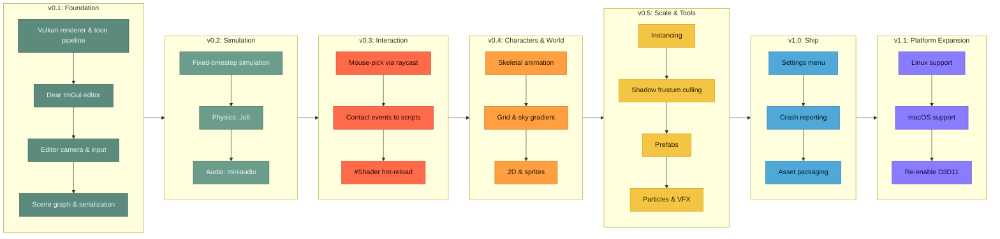

# ToonEngine Roadmap

One list, start to finish in ranked order. There are no
calendar dates: an item moves up when something below finishes and frees it to start, or when
new research (see the `update-roadmap` skill) finds a reason to re-rank it. For the reasoning
behind already-shipped systems, see [MEMORY.md](../MEMORY.md); for the project's guiding
principle (build on Diligent, don't reinvent it), see [CLAUDE.md](../CLAUDE.md).

```
Shipped  ███████░░░░░░░░░░░░░░░░  7 / 23 items
```



## Shipped

1. **Vulkan renderer and toon pipeline**: cel-shaded fill + inverted-hull outline, cascaded
   shadow maps, an HDR G-buffer, and a full DiligentFX post chain (SSAO, TAA/DoF/SSR, Bloom,
   ACES tone-mapping).
2. **Dear ImGui editor**: hierarchy panel, Properties inspector with an ImGuizmo gizmo,
   Settings panel, Asset Browser with thumbnails, three themes.
3. **Editor camera and input**: orbit/pan/zoom/fly/focus camera, a rebindable action-map
   input system (mouse/keyboard/gamepad).
4. **Entity-tree scene graph and serialization**: hierarchy-composed world transforms,
   save/load to `.scene` text files.
5. **Fixed-timestep simulation**: a decoupled 60 Hz sim tick with render interpolation,
   per-entity native scripts, and Play/Step/Stop editor modes.
6. **Physics**: Jolt rigid bodies, Box/Sphere/Capsule colliders, raycasts, a collider debug
   wireframe.
7. **Audio**: positional 3D SFX and music (miniaudio), an `AudioSource` entity component.

## What's Next, Most to Least Important

8. **Mouse-pick via raycast.** Wire the already-shipped `PhysicsWorld::Raycast` to
   click-to-select in the editor viewport. Ranked first because the hard part, the raycast
   itself, already exists; this is a small, self-contained wiring task with an immediate,
   visible payoff.
9. **Contact events to scripts.** An `OnCollision`-style `Script` hook driven by a Jolt
   contact listener, so gameplay scripts can react to physical contact instead of only
   polling transforms. Same tier as mouse-pick for the same reason: no new subsystem, just
   wiring an existing one (physics) to another existing one (scripts). Several later items
   (particles on impact, sprite hit-reactions) will eventually want this to exist first.
10. **Shader hot-reload.** Diligent already provides the mechanism
    (`IRenderStateCache`, `EnableHotReload` + `Reload()`, reachable through the linked
    `Diligent-GraphicsTools`, confirmed against Diligent's 2.5.3 release notes and
    `Tutorial26_StateCache`). Ranked here, ahead of the shader-heavy content work below it,
    because every one of those items means writing and iterating on new HLSL; paying for
    faster iteration now pays back on all of them.
11. **Skeletal animation.** Play the fox/dragon clips via an animation entity component.
    The first of three ports from `ToonEngineOld` (the old OpenGL 4.1 engine kept only as a
    porting reference, see MEMORY.md's "ToonEngineOld: Carry-Over Reference"); its
    `animator.cpp` (keyframe sampling, topological joint-hierarchy evaluation, bind-pose
    fallback for un-animated joints) ports close to line-for-line. Ranked ahead of the two
    items below it because animated characters are the single biggest lever for making the
    world read as an actual game instead of a static tech demo.
12. **Grid and sky gradient.** An HLSL port of `ToonEngineOld`'s editor backdrop
    (`grid.frag`'s ray-plane intersection against Y = 0, with `SV_Depth` writes so the plane
    doesn't occlude geometry between grid lines). Ranked after animation because nothing
    depends on it, but ahead of sprites because a working backdrop makes every other visual
    feature, sprites included, easier to judge by eye.
13. **2D and sprites.** A sprite entity component (tint, atlas UV rect, flip X/Y) rendered
    as a back-to-front-sorted transparent pass after the opaque toon pass, matching
    `ToonEngineOld`'s `ShadingMode::Sprite` design. Last of the three ports: sprites earn
    their place once there's a reason to place 2D elements in the world, which the two items
    above it start to create.
14. **Instancing.** A per-instance draw path for scenes with many copies of the same mesh.
    Ranked here because it only pays off once a scene actually has enough repeated objects
    to matter, which the content systems above it are what will start creating that
    scenario.
15. **Shadow frustum culling.** Bounds-test each entity against a cascade's frustum before
    drawing it into that cascade's shadow pass, instead of today's unconditional
    every-entity-into-every-cascade loop, a gap deliberately deferred when cascaded shadow
    maps shipped (see MEMORY.md's "Toon Pipeline" section). Ranked right after instancing
    because both are scale-driven: cheap and correct to add whenever someone's already
    touching the shadow pass, but nothing today measures it as an actual bottleneck at the
    current scene's object count, so it stays below every content system that outranks it.
16. **Prefabs.** Reusable entity templates for runtime spawning. A workflow multiplier: it
    cuts the cost of populating a scene with everything shipped above it, so it's ranked
    ahead of pure-visual polish that doesn't compound the same way.
17. **Particles and VFX.** A toon-appropriate particle system. Doesn't depend on anything
    above it and doesn't unlock anything below it either, so it sits after the items that do
    one or the other.
18. **Settings menu.** A player-facing menu for display (resolution, fullscreen, VSync) and
    input (a rebind UI over the already-shipped action-map system), replacing today's
    dev-only Settings panel for anything a player, not a developer, needs to control. Steam's
    own launch checklist tests for exactly this, and ToonEngine has no player-facing display
    settings today. Ranked with crash reporting and asset packaging below it because none of
    the three block or unlock anything else; they're release-readiness work a real release
    can't ship without, not features that create new gameplay.
19. **Crash reporting.** A crash-reporting handler or SDK integration so a crash leaves a
    diagnostic trail instead of a silent exit, tested against a live endpoint before release,
    per Steam's own launch checklist. Ranked next to the settings menu for the same reason: a
    small, bounded release requirement, not a new subsystem, closer in shape to asset
    packaging below it than to any content system above it.
20. **Asset packaging for a shippable build.** Relative shader/asset paths so the engine can
    ship outside a dev environment. A genuine hard requirement before any real release, but
    small and mechanical, and it blocks nothing above it. Ranked alongside the settings menu
    and crash reporting above it, the same release-readiness cluster, without displacing the
    systems that need to exist before there's a game worth releasing.
21. **Linux support** (Vulkan). Expands the eventual audience, but Windows-only is a normal,
    viable starting point for a first release on Steam; a solo project's time before that
    point is better spent on the game itself than a second platform.
22. **macOS support** (Vulkan via MoltenVK, needs an `NSView` from a GLFW Cocoa `.mm`
    helper). Ranked after Linux because it builds on the same Vulkan-portability work Linux
    already exercises, and because it's the smaller of the two non-Windows audiences for a
    PC-first indie title.
23. **Re-enable D3D11.** Only matters for players on hardware too old for Vulkan, a small
    and shrinking slice of the Steam hardware survey. Ranked last because every item above
    it either unlocks gameplay, unlocks content, or is a hard release requirement, and this
    is none of those.

## Researched, Not Yet Ranked

Two items from the most recent `update-roadmap` pass cleared the research bar but not the
"rank it now" bar; noted here so they aren't rediscovered from scratch next time.

- **Player save/progress system**, distinct from the existing `.scene` authoring
  serialization (a checkpoint/inventory/unlocked-state format, not a full scene dump). Real
  Steam cloud-save support needs something save-shaped to sync first, but nothing shipped yet
  produces actual player state to persist, so this has no scene to attach to until a real
  gameplay loop exists.
- **Achievements/stats and Steam Input controller glyph mapping.** Confirmed real Steamworks
  features (`ISteamUserStats`, the Steam Input API), but common for a solo dev to add
  post-launch rather than at launch, and both are additive once there's actual gameplay to
  hook them into.

## How This List Is Maintained

- `update-roadmap` researches what to add and where to rank it (architectural health, gaps
  blocking a Steam release, performance) and proposes changes to this file.
- `plan-roadmap` takes the top not-yet-shipped item, or one the user names directly, and
  designs it in depth before implementation starts.
- `tidy-md` moves an item's design/rationale into MEMORY.md and marks it shipped here once
  it lands, renumbering the list so it still reads start to finish with no gaps.