# ToonEngine Roadmap

One list, start to finish in ranked order. There are no
calendar dates: an item moves up when something below finishes and frees it to start, or when
new research finds a reason to re-rank it. Item 32 (a packaged-build smoke test) is the last
item scoped for 1.0, the official release; everything ranked after it is post-1.0 polish and
non-essential expansion, the tail of the same ranked sequence, not a separate bucket. The
project's guiding principle is to build on Diligent Engine, not reinvent it.

```
Shipped  ███████████████████░░░░░░░░░░░░░░░░░░  19 / 37 items
```



```mermaid
flowchart LR
    subgraph V01["v0.1"]
        direction TB
        S1["Vulkan renderer &amp; toon pipeline"]
        S2["Dear ImGui editor"]
        S3["Editor camera &amp; input"]
        S1 --> S2 --> S3
    end

    subgraph V02["v0.2"]
        direction TB
        S4["Scene graph &amp; serialization"]
        S5["Fixed-timestep simulation"]
        S6["Physics: Jolt"]
        S4 --> S5 --> S6
    end

    subgraph V03["v0.3"]
        direction TB
        S7["Audio: miniaudio"]
        S8["Mouse-pick via raycast"]
        S9["Contact events to scripts"]
        S7 --> S8 --> S9
    end

    subgraph V04["v0.4"]
        direction TB
        S10["Shader hot-reload"]
        S11["Skeletal animation"]
        S12["Grid &amp; sky gradient"]
        S10 --> S11 --> S12
    end

    subgraph V05["v0.5"]
        direction TB
        S13["2D &amp; sprites"]
        S14["2D editor mode"]
        S13 --> S14
    end

    subgraph V06["v0.6"]
        direction TB
        S15["Game runtime mode"]
        S16["Asset packaging"]
        S18["In-game UI &amp; HUD"]
        S15 --> S16 --> S18
    end

    subgraph V07["v0.7"]
        direction TB
        S17["Player save system"]
        S19["Level transitions"]
        N20["Input to gameplay"]
        S17 --> S19 --> N20
    end

    subgraph V08["v0.8"]
        direction TB
        N21["Resource manager"]
        N22["Instancing"]
        N23["Frustum culling"]
        N21 --> N22 --> N23
    end

    subgraph V09["v0.9"]
        direction TB
        N24["Prefabs"]
        N25["Particles &amp; VFX"]
        N26["Steamworks SDK bootstrap"]
        N27["Settings menu"]
        N24 --> N25 --> N26 --> N27
    end

    subgraph V10["v1.0: Official Release"]
        direction TB
        N28["Controller UI &amp; Steam Deck keyboard"]
        N29["Steam Cloud saves"]
        N30["Crash reporting"]
        N31["SteamPipe depot upload"]
        N32["Packaged-build smoke test"]
        N28 --> N29 --> N30 --> N31 --> N32
    end

    subgraph V11["v1.1: Post-1.0 Polish"]
        direction TB
        N33["Achievements &amp; stats"]
        N34["Localization pipeline"]
        N33 --> N34
    end

    subgraph V12["v1.2: Platform Expansion"]
        direction TB
        N35["Linux support"]
        N36["macOS support"]
        N37["Re-enable D3D11"]
        N35 --> N36 --> N37
    end

    V01 --> V02 --> V03 --> V04 --> V05 --> V06 --> V07 --> V08 --> V09 --> V10 --> V11 --> V12

    classDef v01 fill:#5C8A7D,stroke:#3f6357,color:#EAF6F1;
    classDef v02 fill:#6B9C8C,stroke:#4a7062,color:#EAF6F1;
    classDef v03 fill:#5C8A7D,stroke:#3f6357,color:#EAF6F1;
    classDef v04 fill:#5C8A7D,stroke:#3f6357,color:#EAF6F1;
    classDef v05 fill:#5C8A7D,stroke:#3f6357,color:#EAF6F1;
    classDef shipped fill:#5C8A7D,stroke:#3f6357,color:#EAF6F1;
    classDef v06 fill:#F4C542,stroke:#c99e28,color:#2B2100;
    classDef v07 fill:#F2835C,stroke:#c25f3a,color:#2B0D00;
    classDef v08 fill:#4FB8A8,stroke:#2f8a7c,color:#00201C;
    classDef v09 fill:#4FA8D8,stroke:#2f7fac,color:#00202E;
    classDef v10 fill:#E8B84F,stroke:#b8872f,color:#2B1D00;
    classDef v11 fill:#8A7CFF,stroke:#6357cc,color:#160B3E;
    classDef v12 fill:#B39DDB,stroke:#8672b0,color:#1F1730;

    class S1,S2,S3 v01
    class S4,S5,S6 v02
    class S7,S8,S9 v03
    class S10,S11,S12 v04
    class S13,S14 v05
    class S15,S16,S17,S18,S19 shipped
    class N20 v07
    class N21,N22,N23 v08
    class N24,N25,N26,N27 v09
    class N28,N29,N30,N31,N32 v10
    class N33,N34 v11
    class N35,N36,N37 v12
```

## Shipped

1. **Vulkan renderer and toon pipeline**: cel-shaded fill + inverted-hull outline, cascaded
   shadow maps, an HDR G-buffer, and a full DiligentFX post chain (SSAO, TAA/DoF/SSR, Bloom,
   ACES tone-mapping).
2. **Dear ImGui editor**: hierarchy panel, Properties inspector with an ImGuizmo gizmo,
   Settings panel, Asset Browser with thumbnails, three themes.
3. **Editor camera and input**: orbit/pan/zoom/fly/focus camera, a rebindable action-map
   input system (mouse/keyboard/gamepad).
4. **Entity-tree scene graph and serialization**: hierarchy-composed world transforms,
   save/load to `.scene` text files.
5. **Fixed-timestep simulation**: a decoupled 60 Hz sim tick with render interpolation,
   per-entity native scripts, and Play/Step/Stop editor modes.
6. **Physics**: Jolt rigid bodies, Box/Sphere/Capsule colliders, raycasts, a collider debug
   wireframe.
7. **Audio**: positional 3D SFX and music (miniaudio), an `AudioSource` entity component.
8. **Mouse-pick**: geometric ray-vs-bounds click-to-select in the viewport, not the physics
   raycast (which only exists while Playing), with a fallback pick box for collider-less
   entities.
9. **Contact events to scripts**: `Script::OnCollisionEnter`/`OnCollisionStay`/
   `OnCollisionExit` hooks driven by a Jolt contact listener, so gameplay scripts react to
   physical contact instead of only polling transforms.
10. **Shader hot-reload**: every shader/PSO routes through Diligent's `IRenderStateCache`; a
    Debug-only `efsw` file watcher (plus a manual Settings-panel fallback) recompiles a
    `.hlsl`/`.hlsli` file the moment it's saved, no editor restart needed. Compiled out of
    Release builds entirely.
11. **Skeletal animation**: every animated model's bone pose samples through Diligent's own
    `GLTF::Model::ComputeTransforms` into a growable joint-matrix palette, skinned in the
    vertex shader through a dedicated fill/outline/shadow PSO trio; an `AnimationComponent`
    drives clip playback in the fixed 60 Hz sim tick. The Khronos fox test asset is the
    demo scene's first animated entity.
12. **Grid and sky gradient**: an infinite ground grid (DiligentFX's own
    `CoordinateGridRenderer`, antialiased multi-LOD lines, colored X/Z axes) and a
    world-space vertical sky gradient behind the scene, both toggled from Settings >
    Environment.
13. **2D and sprites**: a `SpriteComponent` (texture, tint, atlas UV rect, flip X/Y) drawn as
    a back-to-front-sorted transparent pass after the opaque toon pass, matching
    `ToonEngineOld`'s `ShadingMode::Sprite` design, with real mouse-pick bounds (not the
    generic marker box every other boundless entity gets) and full `.scene` serialization.
14. **2D editor mode**: a Settings-panel toggle that locks the viewport to an orthographic
    camera facing the sprite plane (`Camera::orthographic`/`orthoHeight`), rather than forking
    the scene into a separate 2D representation. Entering saves the 3D yaw/pitch to restore on
    exit, orbit and fly are disabled while locked, zoom scales the visible world extent instead
    of camera distance, the gizmo drops its out-of-plane axis, and the ground grid switches from
    the XZ plane to XY.
15. **Standalone runtime and application state machine**: a `RuntimeState` (the engine half)
    split out of `EditorState`, a shared `TickRuntime`/`RenderScene` the editor and player both
    drive, and an `AppState` machine (Boot/Title/Loading/Playing/Paused/Quit) behind one
    `SetAppState` funnel, kept a separate axis from the editor's `EditorMode`. A `ToonRuntime`
    static library feeds two executables: the editor (`ToonEngine`) and a chrome-free
    `ToonPlayer` (also reachable via `ToonEngine --play`), which renders from a scene's primary
    `CameraComponent` rather than the editor's orbit camera. Loading is a per-frame-drained work
    list, and the grid/collider/mouse-pick overlays moved to the editor-only render path so a
    shipped frame never draws them.
16. **Asset packaging for a shippable build**: exe-relative asset resolution (a
    `core/platform/paths` module, `toon::Assets`, resolves `assets/` next to the executable via
    `GetModuleFileNameW`, falling back to the source tree for dev builds) plus component-scoped
    CMake `install()` rules that stage the two executables, the `assets/` tree, and the engine
    DLLs into a relocatable folder, so a standalone build runs outside the dev tree. Writable
    user data (rebound bindings, saved scenes) stays on the read path for now, deferred to the
    save system (item 17).
17. **Player save/progress system**: a game-state document distinct from the `.scene` authoring
    format, saving what a player does in a running game rather than a full scene dump. A
    `core/save/savegame` module (a `SaveGame` of version, active scene, playtime, and an opaque
    game-owned blob, plus versioned text read/write with a newer-version-rejects guard) writes
    to a per-user writable directory a new `toon::UserData` path resolver supplies
    (`%LOCALAPPDATA%/ToonEngine/saves/local`), the write-side twin of the read-only `Assets`
    tree, so a read-only installed build still saves. The player's title screen gained New Game /
    Continue plus an F5 quick-save and autosave-on-pause; the editor's Playback panel gained dev
    Save/Load buttons over the same glue. The `local` path segment is the seam for Steam's
    `{64BitSteamID}` (item 26); the real gameplay schema (inventory, unlock flags, checkpoints)
    lands in the blob later as a data change. Display and graphics settings stay out of the save
    path, per Valve's advice against syncing machine-specific configuration.
18. **In-game UI, HUD, and text rendering**: player-facing UI outside Dear ImGui (which the
    shipped `ToonPlayer` never initializes), built as Ryan Fleury's immediate-mode API over a
    persistent, per-frame-pruned box cache keyed by hashed IDs, one unified system for both HUD
    and menus. A Diligent-free `core/ui/` module (the box cache with a semantic-size layout
    solve, last-frame-rect hit-testing, directional focus navigation, and floating/anchor boxes;
    MSDF text; a `key = value` string table) drives one thin renderer primitive, `DrawUI`, that
    draws a screen-space quad batch after `EndScene` onto the resolved back buffer. Text is MTSDF
    (median-of-3 with `fwidth` screen-pixel-range AA), staying crisp from Steam Deck to 4K out of
    one atlas; a shared `RenderHUD` builds the Title/Loading/Playing/Paused screens for both the
    player and the editor. Every player-facing string routes through a lookup key, the seam that
    makes localization (item 34) a data change; panels use rounded-rect SDF borders and textured
    9-slice, and the strings, font, and panel textures hot-reload live in Debug builds.
19. **Scene and level transitions**: level changes requested from gameplay code rather than the
    editor's File menu, with a scene's scripts, physics bodies, and audio handles released in
    dependency order (scripts' `OnDestroy` first, then audio, then physics last). The operations
    that bring a scene to life and tear it down, `BeginSession`/`EndSession`, moved out of an
    editor-only translation unit into `app/session`, which both fixed the shipped player running
    no scripts, physics, or audio and made a transition expressible as end + load + begin. The
    swap runs at one known-safe point outside the fixed-step sim and every script/physics/audio
    callback, and loads the incoming level into a side buffer before tearing the old one down, so
    a bad path leaves the current level playing. A fade rides a copy of the tone-map exposure
    rather than a new overlay or shader. Freeing the outgoing level's GPU handles is left to the
    resource manager (item 21), which owns that lifetime.

## What's Next, Most to Least Important

20. **Input to gameplay: reaching scripts from the action-map system.** A path from the
    already-shipped action-map input system to gameplay scripts. `Script::OnUpdate` receives only
    its entity, the scene, and the frame delta today, and the `InputSystem` lives in the editor/app
    layer, so a gameplay script cannot read a button or axis: the demo scripts only advance
    transforms by time. Ranked at the top of what's left because it is the prerequisite for any
    actual gameplay, and because the settings-menu rebind UI (item 27) and controller-navigable UI
    (item 28) both assume input that already reaches something a player controls. Scope is the seam,
    not a full character controller: expose the current action state and edge events to the script
    tick behind the same backend- and platform-agnostic boundary the rest of the engine keeps, so
    gameplay stays plain data reacting to input.
21. **Resource manager with reference counting.** A load-path cache and ownership model for
    textures, models, and audio clips. There's no dedupe today, so two sprites naming the same
    PNG create two GPU textures, and `Renderer::DestroyTexture` is the entire lifetime story;
    `ui/thumbnail_cache.h` is already a one-off of this idea scoped to browser icons. Already a
    correctness gap, not just a bounded leak: scene transitions (item 19) now free nothing on the
    GPU when a level unloads, leaking the outgoing level's meshes and textures on every load, and
    unloading correctly means freeing exactly what no other level still holds. Retires the
    thumbnail cache's duplicate logic in the same pass.
22. **Instancing.** A per-instance draw path for scenes with many copies of the same mesh.
    Ranked here because it only pays off once a scene actually has enough repeated objects
    to matter, which the content systems above it are what will start creating that
    scenario. `Renderer::DrawMesh`/`DrawModel` already rebind the same outline/fill PSOs on
    every entity even when they're shared, the same redundant state-setting this item's
    batching would remove, so fold that cleanup into the same pass rather than a separate one.
23. **Frustum culling: shadow cascades and the main pass.** Bounds-test each entity against
    the camera/cascade frustum before drawing it, instead of today's unconditional
    every-entity loop in both the shadow pass and the main color pass
    (`app/editor_render.cpp`'s `RenderFrame`). The shadow half was deliberately deferred when
    cascaded shadow maps shipped; the main pass shares the same gap and was never named
    alongside it. Do the shadow half first: it draws every entity into all four cascades, so it
    carries a roughly fourfold multiplier and is the sub-part that becomes draw-call-bound first.
    Ranked right after instancing because both are scale-driven: cheap and correct to add whenever
    someone's already touching either draw loop, but nothing today measures either as an actual
    bottleneck at the current scene's object count, so it stays below every content system that
    outranks it.
24. **Prefabs.** Reusable entity templates for runtime spawning. A workflow multiplier: it
    cuts the cost of populating a scene with everything shipped above it, so it's ranked
    ahead of pure-visual polish that doesn't compound the same way.
25. **Particles and VFX.** A toon-appropriate particle system. Doesn't depend on anything
    above it and doesn't unlock anything below it either, so it sits after the items that do
    one or the other.
26. **Steamworks SDK bootstrap.** Link the Steamworks SDK and wire `SteamAPI_Init`/
    `SteamAPI_Shutdown`, a per-frame `SteamAPI_RunCallbacks`, a dev-time `steam_appid.txt`,
    and the overlay-activation callback. Small and mechanical, but every other Steam-specific
    item, the controller and glyph work two below this one and achievements after 1.0
    (item 33), assumes this exists first. The overlay is an implicit Vulkan layer, so this item
    also has to confirm Diligent forwards the instance and device extensions the layer requests at
    device creation, or the overlay, its screenshots, and its notifications silently fail; verify
    that at the packaged-build smoke test (item 32). Testable from a dev exe on its own, so it
    doesn't wait on the runtime; ranked ahead of the settings menu because it blocks nothing above
    it and opens the release-readiness cluster the rest of this tier belongs to.
27. **Settings menu.** A player-facing menu for display (resolution, fullscreen, VSync), input
    (a rebind UI over the already-shipped action-map system), and audio, built on the in-game
    UI system from item 18 and replacing today's dev-only Settings panel for anything a player
    rather than a developer needs to control. Steam's own launch checklist tests for exactly
    this, and ToonEngine has no player-facing display settings today. Two engine-side pieces
    land with it: an audio bus split (Master, Music, SFX through `ma_sound_group` behind the
    existing `AudioEngine` seam), since `SetMasterVolume` is currently the only volume control
    and one slider isn't what a settings menu offers; and persisting settings locally per
    device rather than through cloud sync, per Valve's Steam Deck guidance. Should default to,
    or strongly favor, borderless windowed over true exclusive fullscreen, which has documented
    rendering failures for Vulkan titles under the Steam Overlay.
28. **Controller-navigable UI, Steam Deck on-screen keyboard, and Steam Input glyphs.** Every
    player-facing menu navigable end to end with a controller, `ShowGamepadTextInput`/
    `ShowFloatingGamepadTextInput` wired for any text entry, on-screen glyphs mapped to
    whichever controller is actually active, and a default controller configuration published
    on the partner site that reaches all content. All four are named Steam Deck Verified input
    criteria, which is why glyph mapping sits here inside 1.0 rather than with achievements
    after it: matching icons to the active device is a stated requirement, while achievements
    aren't. Ranked directly after the settings menu because it hardens the player-facing menus
    that item establishes.
29. **Steam Cloud saves.** Auto-Cloud plus the code the save system's `local` path segment was
    left as a seam for: switch the save directory from `local` to the player's `{64BitSteamID}`
    from `ISteamUser`, and handle Steam Deck's Dynamic Cloud Sync notification so a session
    suspended on the Deck resumes on the desktop against the right save. The save system (item 17)
    shipped the local half, and both it and the `paths` resolver already name this as downstream
    work; it is more than the partner-site configuration that note assumed. Depends on the
    Steamworks bootstrap (item 26); ranked just after the controller and Deck work because
    cross-device saves are the standard Steam expectation and the Deck's suspend/resume story
    leans on them.
30. **Crash reporting.** A crash-reporting handler or SDK integration so a crash leaves a
    diagnostic trail instead of a silent exit, tested against a live endpoint before release,
    per Steam's own launch checklist. Valve's own `SteamAPI_WriteMiniDump` is documented as
    32-bit-Windows-only, so the real implementation will be a third-party service (Sentry,
    Backtrace, or a Breakpad-based one), not the Steamworks call itself. Scope it to cover the
    highest-probability crash class for a Vulkan title specifically: swapchain recreation on
    alt-tab, resize, monitor change, or Deck resume, and device loss under the Steam Overlay's
    Vulkan layer. Ranked next to the settings menu as a small, bounded release requirement
    rather than a new subsystem.
31. **SteamPipe depot and build upload tooling.** The `app_build.vdf` plus per-depot
    `depot_build.vdf` config and `steamcmd +run_app_build` invocation Valve's own SteamPipe
    system needs to actually push a built game onto Steam's content delivery network,
    distinct from asset packaging (item 16), which makes the engine runnable outside a dev
    environment but doesn't get that build onto Steam's servers. Ranked here because it depends
    on that item's relative-path packaging existing first: there's nothing to upload to a depot
    until the build actually runs standalone.
32. **Packaged-build smoke test.** Produce a release artifact and launch it unattended, from an
    installed depot rather than the dev tree, before any build goes live on the default branch.
    Items 16 and 31 produce the artifact; neither proves it runs, and the classic launch-day
    failure is a build that works in the dev environment but not once installed: a missing
    engine DLL, one surviving absolute path, a shipped `steam_appid.txt`. Valve's own advice is
    to test through a beta branch first. Ranked last inside 1.0 because it has no value until
    both items it verifies exist. The last item scoped for 1.0; everything below this line
    ships after the official release.
33. **Achievements and stats.** `ISteamUserStats` wiring for achievements and stat tracking.
    Depends on Steamworks SDK bootstrap (item 26) existing first, and is additive once there's
    actual gameplay to hook it into, which is why it's common for a solo developer to add it
    after launch rather than at launch: the first item ranked after the 1.0 boundary rather
    than inside it.
34. **Localization and text pipeline.** External string tables, per-language font atlases, and
    CJK fallback fonts (the Noto and Source Han families rather than one atlas), plus declaring
    supported languages on the partner site's Depots page. Every user-facing string already
    routes through a lookup key (item 18 shipped that seam), but there's a single English table,
    no per-language atlas, and no CJK fallback today. Not blocking for a Windows-only English
    first release, which is why it ranks after 1.0; the lookup-key indirection is what keeps this
    a data change rather than a rewrite of every menu. Also interacts with Steam Deck's
    legibility floor, since translated strings routinely run longer than the English source.
35. **Linux support** (Vulkan). Expands the eventual audience, but Windows-only is a normal,
    viable starting point for a first release on Steam; a solo project's time before that
    point is better spent on the game itself than a second platform.
36. **macOS support** (Vulkan via MoltenVK, needs an `NSView` from a GLFW Cocoa `.mm`
    helper). Ranked after Linux because it builds on the same Vulkan-portability work Linux
    already exercises, and because it's the smaller of the two non-Windows audiences for a
    PC-first indie title.
37. **Re-enable D3D11.** Only matters for players on hardware too old for Vulkan, a small
    and shrinking slice of the Steam hardware survey. Ranked last because every item above
    it either unlocks gameplay, unlocks content, or is a hard release requirement, and this
    is none of those.

## How This List Is Maintained

- `update-roadmap` researches what to add and where to rank it (architectural health, gaps
  blocking a Steam release, performance) and decides the rank directly rather than parking a
  candidate in a separate unranked section; every item on this list, gameplay or otherwise,
  has an actual number. It also promotes an item that's actually shipped: preserves its
  design/rationale, moves it into "Shipped," and renumbers the list so it still reads start to
  finish with no gaps (promoting the top-ranked pending item needs no renumbering at all; see
  the skill file for when it actually does).
- `plan-roadmap` takes the top not-yet-shipped item, or one the user names directly, and
  designs it in depth before implementation starts.
- `tidy-md` keeps this file's prose and cross-references accurate and current, the same
  treatment as `docs/architecture.md`, but doesn't touch the ranked-list content itself.
