# ToonEngine Roadmap

One list, start to finish in ranked order. There are no
calendar dates: an item moves up when something below finishes and frees it to start, or when
new research finds a reason to re-rank it. Item 26 (SteamPipe depot and build upload tooling)
is the last item scoped for 1.0, the official release; everything ranked after it is post-1.0
polish and non-essential expansion, the tail of the same ranked sequence, not a separate
bucket. The project's guiding principle is to build on Diligent Engine, not reinvent it.

```
Shipped  █████████████░░░░░░░░░░░░░░░░░  13 / 30 items
```



```mermaid
flowchart LR
    subgraph V01["v0.1"]
        direction TB
        S1["Vulkan renderer &amp; toon pipeline"]
        S2["Dear ImGui editor"]
        S3["Editor camera &amp; input"]
        S1 --> S2 --> S3
    end

    subgraph V02["v0.2"]
        direction TB
        S4["Scene graph &amp; serialization"]
        S5["Fixed-timestep simulation"]
        S6["Physics: Jolt"]
        S4 --> S5 --> S6
    end

    subgraph V03["v0.3"]
        direction TB
        S7["Audio: miniaudio"]
        S8["Mouse-pick via raycast"]
        S9["Contact events to scripts"]
        S7 --> S8 --> S9
    end

    subgraph V04["v0.4"]
        direction TB
        S10["Shader hot-reload"]
        S11["Skeletal animation"]
        S12["Grid &amp; sky gradient"]
        S10 --> S11 --> S12
    end

    subgraph V05["v0.5"]
        direction TB
        S13["2D &amp; sprites"]
        N14["2D editor mode"]
        N15["Lua scripting"]
        S13 --> N14 --> N15
    end

    subgraph V06["v0.6"]
        direction TB
        N16["Player save system"]
        N17["Instancing"]
        N18["Frustum culling"]
        N16 --> N17 --> N18
    end

    subgraph V07["v0.7"]
        direction TB
        N19["Prefabs"]
        N20["Particles &amp; VFX"]
        N19 --> N20
    end

    subgraph V08["v0.8"]
        direction TB
        N21["Steamworks SDK bootstrap"]
        N22["Settings menu"]
        N21 --> N22
    end

    subgraph V09["v0.9"]
        direction TB
        N23["Controller UI &amp; Steam Deck keyboard"]
        N24["Crash reporting"]
        N23 --> N24
    end

    subgraph V10["v1.0: Official Release"]
        direction TB
        N25["Asset packaging"]
        N26["SteamPipe depot upload"]
        N25 --> N26
    end

    subgraph V11["v1.1: Post-1.0 Polish"]
        direction TB
        N27["Achievements &amp; Steam Input glyphs"]
    end

    subgraph V12["v1.2: Platform Expansion"]
        direction TB
        N28["Linux support"]
        N29["macOS support"]
        N30["Re-enable D3D11"]
        N28 --> N29 --> N30
    end

    V01 --> V02 --> V03 --> V04 --> V05 --> V06 --> V07 --> V08 --> V09 --> V10 --> V11 --> V12

    classDef v01 fill:#5C8A7D,stroke:#3f6357,color:#EAF6F1;
    classDef v02 fill:#6B9C8C,stroke:#4a7062,color:#EAF6F1;
    classDef v03 fill:#5C8A7D,stroke:#3f6357,color:#EAF6F1;
    classDef v04 fill:#5C8A7D,stroke:#3f6357,color:#EAF6F1;
    classDef v05 fill:#FF9F40,stroke:#c97927,color:#2B1400;
    classDef v06 fill:#F4C542,stroke:#c99e28,color:#2B2100;
    classDef v07 fill:#F2835C,stroke:#c25f3a,color:#2B0D00;
    classDef v08 fill:#4FB8A8,stroke:#2f8a7c,color:#00201C;
    classDef v09 fill:#4FA8D8,stroke:#2f7fac,color:#00202E;
    classDef v10 fill:#E8B84F,stroke:#b8872f,color:#2B1D00;
    classDef v11 fill:#8A7CFF,stroke:#6357cc,color:#160B3E;
    classDef v12 fill:#B39DDB,stroke:#8672b0,color:#1F1730;
    classDef shipped fill:#5C8A7D,stroke:#3f6357,color:#EAF6F1;

    class S1,S2,S3 v01
    class S4,S5,S6 v02
    class S7,S8,S9 v03
    class S10,S11,S12 v04
    class S13 shipped
    class N14,N15 v05
    class N16,N17,N18 v06
    class N19,N20 v07
    class N21,N22 v08
    class N23,N24 v09
    class N25,N26 v10
    class N27 v11
    class N28,N29,N30 v12
```

## Shipped

1. **Vulkan renderer and toon pipeline**: cel-shaded fill + inverted-hull outline, cascaded
   shadow maps, an HDR G-buffer, and a full DiligentFX post chain (SSAO, TAA/DoF/SSR, Bloom,
   ACES tone-mapping).
2. **Dear ImGui editor**: hierarchy panel, Properties inspector with an ImGuizmo gizmo,
   Settings panel, Asset Browser with thumbnails, three themes.
3. **Editor camera and input**: orbit/pan/zoom/fly/focus camera, a rebindable action-map
   input system (mouse/keyboard/gamepad).
4. **Entity-tree scene graph and serialization**: hierarchy-composed world transforms,
   save/load to `.scene` text files.
5. **Fixed-timestep simulation**: a decoupled 60 Hz sim tick with render interpolation,
   per-entity native scripts, and Play/Step/Stop editor modes.
6. **Physics**: Jolt rigid bodies, Box/Sphere/Capsule colliders, raycasts, a collider debug
   wireframe.
7. **Audio**: positional 3D SFX and music (miniaudio), an `AudioSource` entity component.
8. **Mouse-pick**: geometric ray-vs-bounds click-to-select in the viewport, not the physics
   raycast (which only exists while Playing), with a fallback pick box for collider-less
   entities.
9. **Contact events to scripts**: `Script::OnCollisionEnter`/`OnCollisionStay`/
   `OnCollisionExit` hooks driven by a Jolt contact listener, so gameplay scripts react to
   physical contact instead of only polling transforms.
10. **Shader hot-reload**: every shader/PSO routes through Diligent's `IRenderStateCache`; a
    Debug-only `efsw` file watcher (plus a manual Settings-panel fallback) recompiles a
    `.hlsl`/`.hlsli` file the moment it's saved, no editor restart needed. Compiled out of
    Release builds entirely.
11. **Skeletal animation**: every animated model's bone pose samples through Diligent's own
    `GLTF::Model::ComputeTransforms` into a growable joint-matrix palette, skinned in the
    vertex shader through a dedicated fill/outline/shadow PSO trio; an `AnimationComponent`
    drives clip playback in the fixed 60 Hz sim tick. The Khronos fox test asset is the
    demo scene's first animated entity.
12. **Grid and sky gradient**: an infinite ground grid (DiligentFX's own
    `CoordinateGridRenderer`, antialiased multi-LOD lines, colored X/Z axes) and a
    world-space vertical sky gradient behind the scene, both toggled from Settings >
    Environment.
13. **2D and sprites**: a `SpriteComponent` (texture, tint, atlas UV rect, flip X/Y) drawn as
    a back-to-front-sorted transparent pass after the opaque toon pass, matching
    `ToonEngineOld`'s `ShadingMode::Sprite` design, with real mouse-pick bounds (not the
    generic marker box every other boundless entity gets) and full `.scene` serialization.

## What's Next, Most to Least Important

14. **2D editor mode.** A camera/viewport mode toggle (orthographic top-down or side view,
    2D-appropriate gizmo and snap behavior, grid orientation to match) for working with the
    sprite system directly above it, replacing the 3D-only editor camera for scenes built
    primarily from sprites. Ranked ahead of Lua scripting because arranging a scene's content
    comes before scripting what happens in it, and both outrank Instancing/Frustum
    culling/Prefabs/Particles below: those are scale-driven work nothing today measures a need
    for, while 2D mode and Lua scripting are what turn the engine into something a game can
    actually be built and coded in before release.
15. **Lua scripting layer.** Embed a Lua VM and bind it to the existing `Script` extension
    point (`core/scene/script.h`) so gameplay logic can be authored without recompiling the
    engine: a `LuaScript : Script` subclass evaluates a Lua chunk instead of C++ for the same
    per-tick hooks (`OnUpdate`, `OnCollisionEnter`/`Stay`/`Exit`) a native script already gets,
    the exact open-ended extension point `cpp-style-guide.md` §7 names `Script` for. Ranked
    directly below 2D editor mode for the reason above, and above Player save/progress system
    because a save system has nothing to persist until Lua scripting exists to produce actual
    gameplay state.
16. **Player save/progress system**, distinct from the existing `.scene` authoring
    serialization: a checkpoint/inventory/unlocked-state format for what a player actually
    does in a running game, not a full scene dump. Ranked directly after Lua scripting because
    nothing shipped before it produces actual player state worth persisting; a real gameplay
    loop, which Lua scripting is what unlocks, is the prerequisite. Also what real Steam
    cloud-save support would eventually sync, once this exists.
17. **Instancing.** A per-instance draw path for scenes with many copies of the same mesh.
    Ranked here because it only pays off once a scene actually has enough repeated objects
    to matter, which the content systems above it are what will start creating that
    scenario. `Renderer::DrawMesh`/`DrawModel` already rebind the same outline/fill PSOs on
    every entity even when they're shared, the same redundant state-setting this item's
    batching would remove, so fold that cleanup into the same pass rather than a separate one.
18. **Frustum culling: shadow cascades and the main pass.** Bounds-test each entity against
    the camera/cascade frustum before drawing it, instead of today's unconditional
    every-entity loop in both the shadow pass and the main color pass
    (`app/editor_render.cpp`'s `RenderFrame`), a gap deliberately deferred when cascaded
    shadow maps shipped) and shared, it turns out,
    by the main pass that was never named alongside it. Ranked right after instancing
    because both are scale-driven: cheap and correct to add whenever someone's already
    touching either draw loop, but nothing today measures either as an actual bottleneck at
    the current scene's object count, so it stays below every content system that outranks it.
19. **Prefabs.** Reusable entity templates for runtime spawning. A workflow multiplier: it
    cuts the cost of populating a scene with everything shipped above it, so it's ranked
    ahead of pure-visual polish that doesn't compound the same way.
20. **Particles and VFX.** A toon-appropriate particle system. Doesn't depend on anything
    above it and doesn't unlock anything below it either, so it sits after the items that do
    one or the other.
21. **Steamworks SDK bootstrap.** Link the Steamworks SDK and wire `SteamAPI_Init`/
    `SteamAPI_Shutdown`, a per-frame `SteamAPI_RunCallbacks`, a dev-time `steam_appid.txt`,
    and the overlay-activation callback. Small and mechanical, but every other Steam-specific
    item, achievements and Steam Input glyph mapping (item 27, post-1.0) and the
    controller-navigable UI item two below this one, assumes this exists first.
    Ranked ahead of the settings menu because it blocks nothing above it and opens the
    release-readiness cluster the rest of this tier belongs to.
22. **Settings menu.** A player-facing menu for display (resolution, fullscreen, VSync) and
    input (a rebind UI over the already-shipped action-map system), replacing today's
    dev-only Settings panel for anything a player, not a developer, needs to control. Steam's
    own launch checklist tests for exactly this, and ToonEngine has no player-facing display
    settings today. Should default to, or strongly favor, borderless windowed over true
    exclusive fullscreen (Vulkan titles under the Steam Overlay have documented
    exclusive-fullscreen rendering failures), and persist graphics settings per device rather
    than through cloud sync, per Valve's own Steam Deck guidance. Ranked with crash reporting
    and asset packaging below it because none of the three block or unlock anything else;
    they're release-readiness work a real release can't ship without, not features that
    create new gameplay.
23. **Controller-navigable UI and Steam Deck on-screen keyboard.** Every player-facing menu,
    starting with the settings menu this depends on, navigable end to end with a controller,
    plus `ShowGamepadTextInput`/`ShowFloatingGamepadTextInput` wired for any text entry. A
    real, separate requirement from the already-deferred Steam Input glyph mapping (that's
    which icon to show; this is whether the menu can be driven with a controller at all), and
    a genuine lever for Steam Deck Verified badging per Valve's own QA checklist. Ranked
    directly after the settings menu because it hardens the one player-facing menu system
    that item establishes, and is roughly comparable in scope to skeletal animation, not a
    small polish pass.
24. **Crash reporting.** A crash-reporting handler or SDK integration so a crash leaves a
    diagnostic trail instead of a silent exit, tested against a live endpoint before release,
    per Steam's own launch checklist. Valve's own `SteamAPI_WriteMiniDump` is documented as
    32-bit-Windows-only, so the real implementation will be a third-party service (Sentry,
    Backtrace, or a Breakpad-based one), not the Steamworks call itself. Ranked next to the
    settings menu for the same reason: a small, bounded release requirement, not a new
    subsystem, closer in shape to asset packaging below it than to any content system above it.
25. **Asset packaging for a shippable build.** Relative shader/asset paths so the engine can
    ship outside a dev environment. A genuine hard requirement before any real release, but
    small and mechanical, and it blocks nothing above it. Ranked alongside the settings menu
    and crash reporting above it, the same release-readiness cluster, without displacing the
    systems that need to exist before there's a game worth releasing.
26. **SteamPipe depot and build upload tooling.** The `app_build.vdf` plus per-depot
    `depot_build.vdf` config and `steamcmd +run_app_build` invocation Valve's own SteamPipe
    system needs to actually push a built game onto Steam's content delivery network,
    distinct from asset packaging above it, which makes the engine runnable outside a dev
    environment but doesn't get that build onto Steam's servers. Ranked directly after asset
    packaging because it depends on that item's relative-path packaging existing first:
    there's nothing to upload to a depot until the build actually runs standalone. The last
    item scoped for 1.0; everything below this line ships after the official release.
27. **Achievements, stats, and Steam Input controller glyph mapping.** `ISteamUserStats` for
    achievements/stats, plus mapping the Steam Input API's action glyphs to whichever
    controller is active. Both depend on Steamworks SDK bootstrap (item 21) existing first,
    and both are additive once there's actual gameplay to hook them into, common for a solo
    dev to add post-launch rather than at launch: the first item ranked after the 1.0
    boundary rather than inside it.
28. **Linux support** (Vulkan). Expands the eventual audience, but Windows-only is a normal,
    viable starting point for a first release on Steam; a solo project's time before that
    point is better spent on the game itself than a second platform.
29. **macOS support** (Vulkan via MoltenVK, needs an `NSView` from a GLFW Cocoa `.mm`
    helper). Ranked after Linux because it builds on the same Vulkan-portability work Linux
    already exercises, and because it's the smaller of the two non-Windows audiences for a
    PC-first indie title.
30. **Re-enable D3D11.** Only matters for players on hardware too old for Vulkan, a small
    and shrinking slice of the Steam hardware survey. Ranked last because every item above
    it either unlocks gameplay, unlocks content, or is a hard release requirement, and this
    is none of those.

## How This List Is Maintained

- `update-roadmap` researches what to add and where to rank it (architectural health, gaps
  blocking a Steam release, performance) and decides the rank directly rather than parking a
  candidate in a separate unranked section; every item on this list, gameplay or otherwise,
  has an actual number. It also promotes an item that's actually shipped: preserves its
  design/rationale, moves it into "Shipped," and renumbers the list so it still reads start to
  finish with no gaps (promoting the top-ranked pending item needs no renumbering at all; see
  the skill file for when it actually does).
- `plan-roadmap` takes the top not-yet-shipped item, or one the user names directly, and
  designs it in depth before implementation starts.
- `tidy-md` keeps this file's prose and cross-references accurate and current, the same
  treatment as `docs/architecture.md`, but doesn't touch the ranked-list content itself.
